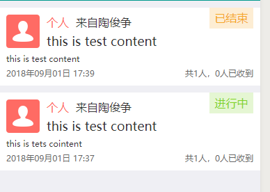
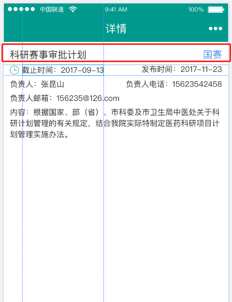
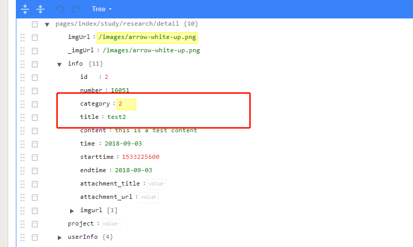
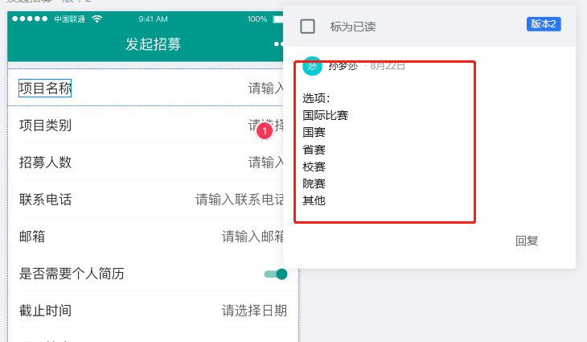

学工宝学生端修改文档
==================

## 消息模块
+ 消息类型改变(不在有个人等,改为全部、普通信息与会议讲座)
  + 约定字段(classify该字段已存在)
    + 普通消息 -- '普通消息'
    + 会议讲座 -- '会议讲座'        
  
  + 消息模块(收到与我要签到)-- 怎么做？？       
        

## 科研赛事
+ 科研赛事详情页
  + 招募令--详情 -- 在线报名缺少接口
         
         
         
  + 发起招募令
    + 项目类别改变(后台改内容)
   

## 问卷调研
+ 获取问卷调查的结果(缺少接口)  