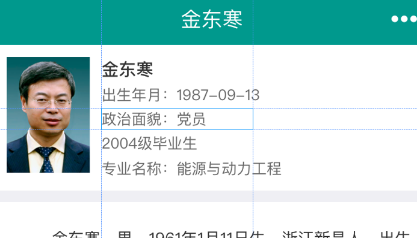
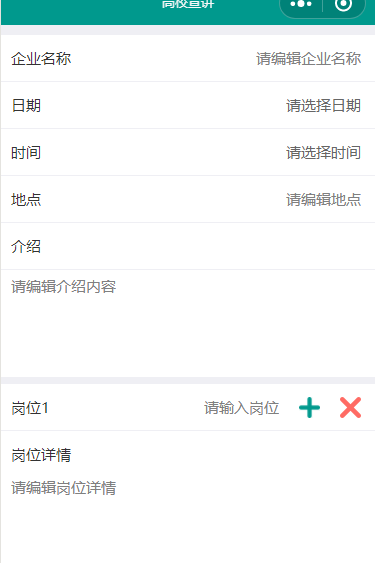
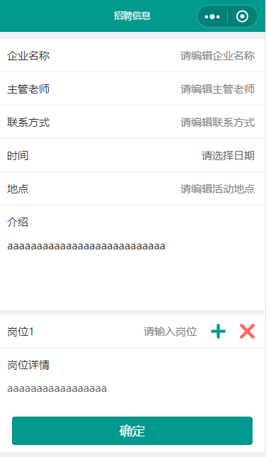
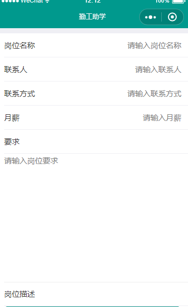
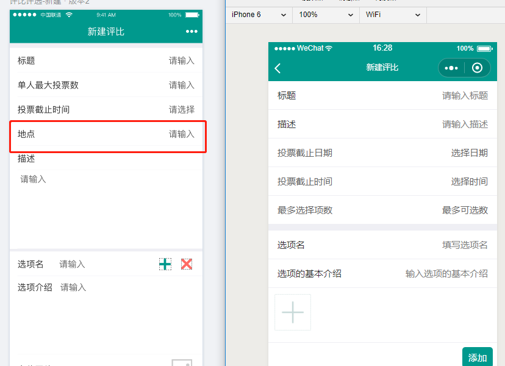

学生端小程序文档
===============
## 勤工助学
+ 在线报名表单增加一栏
  + 联系电话(phone)
## 企业校友
+ 校友详情页的header顶部增加校友信息      
  

教师端小程序文档
===============
## 企业校友 (同学生端)
+ 校友详情页的header顶部增加校友信息      
  

## 高校宣讲
+ 高校宣讲表单格式改变
  + 每一个岗位都有了一个岗位简介      
    
## 招聘信息
+ 发布信息表单格式已改变      
       
## 勤工助学
+ 发布信息表单新增了岗位描述      
  
## 评比评选(表单新增内容 -- 地点)
